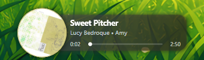
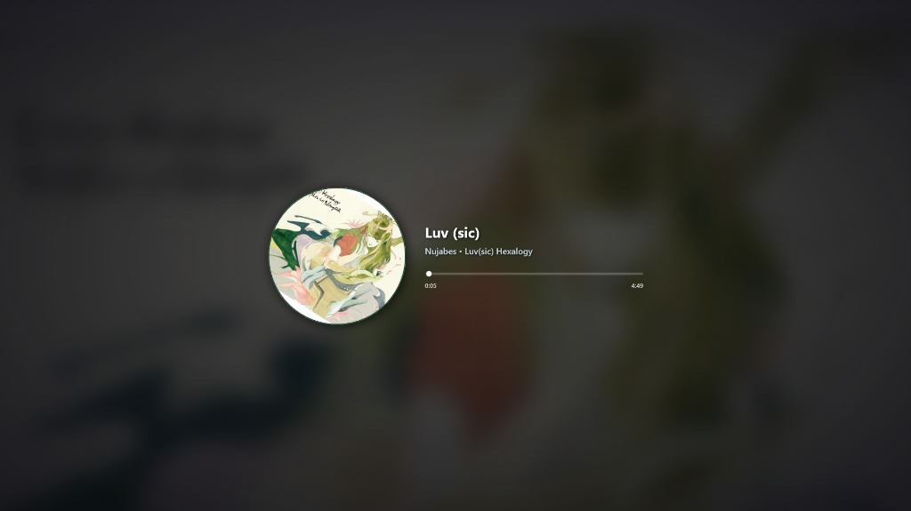
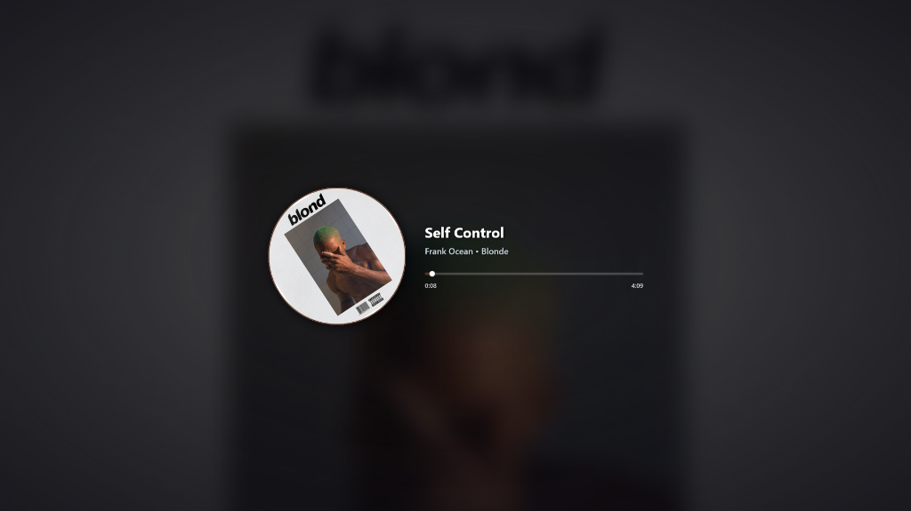

<div align="center">

# 🎵 Spotify Overlay

**An aesthetic, ultra-lightweight, and buttery-smooth desktop overlay for Spotify on Windows.**

[](https://dotnet.microsoft.com/)
[](https://www.microsoft.com/windows)
[](https://opensource.org/licenses/MIT)

<br/>



<p><em>Compact translucent desktop widget with adaptive album color palette and infinite marquee scrolling</em></p>

<br/>

<p align="center">
  
  
</p>
<p><em>Cinematic fullscreen mode with deep 75px Gaussian blurred background and monitor selector</em></p>

</div>

---

## ✨ Features

- 🔄 **Ultra-Smooth Hardware-Accelerated Animation**: Smoothly spinning circular album art powered by `CompositionTarget.Rendering` delta-time animation with subpixel font rendering (zero jitter at any framerate).
- 📜 **Continuous Infinite Marquee**: Seamless single-direction looping title scroll without jumps or truncation. Includes an option to switch to a static ellipsis mode (`...`).
- 🎨 **Adaptive Color Tinting & Smudge Blur**: High-speed (< 1ms) album color extraction that dynamically tints the frosted glass card to match the current track.
- ⭕ **Customizable Outer Ring**: Sleek thin border with multiple color presets (Silver/Metallic, Adaptive Cover Color, Spotify Green, White, Black, Gold, Neon Cyan, or No Ring).
- 🖥️ **Cinematic Fullscreen Mode**:
  - Deep 75px Gaussian blurred background with radial vignette.
  - Multi-monitor support: easily launch fullscreen mode on any connected display.
  - Clean, distraction-free interface with a hover-activated close button.
- 📥 **System Tray Integration**:
  - Runs in the background without cluttering the taskbar.
  - Custom tray icon with context menu and track info tooltip.
  - Double-click to toggle overlay visibility.
- 🚀 **Windows Startup Integration**: Enable or disable auto-launch with Windows in a single click from the context menu.
- ⚡ **Custom Framerate Limiter (FPS)**: Choose between Auto (Native VSync), 30, 60, 120, 144, 240 FPS, or enter any custom value.

---

## 🎮 Controls & Shortcuts

| Action | Shortcut / Control |
|---|---|
| **Move widget** | Left-click and drag anywhere on the card (when unlocked) |
| **Play / Pause** | Double-click the widget / Click progress bar / Press `Spacebar` |
| **Next / Previous Track** | `Right Arrow` / `Left Arrow` (in Fullscreen) or via Context Menu |
| **Open Context Menu** | Right-click the widget or the System Tray icon |
| **Hide / Show Overlay** | Double-click the System Tray icon or via menu |
| **Exit Fullscreen** | Press `ESC` key or click the **✕** button in the top-right corner |

---

## 🛠️ Requirements & Installation

### Requirements
- **Windows 10 (Build 19041+)** or **Windows 11**
- **Spotify** desktop client (official installer or Microsoft Store app)
- **.NET 9.0 Runtime** (only if running unbundled version; single-file build includes all dependencies)

### Quick Start
Run the pre-compiled standalone executable located in the root directory:
```bash
SpotifyOverlay.exe
```

### Build from Source
1. Clone the repository:
   ```bash
   git clone https://github.com/your-username/SpotifyOverlay.git
   cd SpotifyOverlay
   ```
2. Build the project:
   ```bash
   dotnet build -c Release
   ```
3. Publish to a single standalone executable:
   ```bash
   dotnet publish -c Release -r win-x64 -p:PublishSingleFile=true --self-contained false -o ./
   ```

---

## 📁 Project Structure

```
SpotifyOverlay/
├── SpotifyOverlay.exe              # Standalone compiled application
├── SpotifyOverlay.csproj           # .NET 9 WPF project file
├── App.xaml / App.xaml.cs          # Application entry point
│
├── assets/                         # Documentation screenshots
│   ├── compact-overlay.png         # Compact widget screenshot
│   ├── fullscreen-overlay-1.png    # Fullscreen mode showcase (Nujabes)
│   └── fullscreen-overlay-2.png    # Fullscreen mode showcase (Blonde)
│
├── Views/                          # UI Windows & Dialogs
│   ├── MainWindow.xaml / .cs       # Compact overlay & tray controller
│   ├── FullscreenOverlayWindow.xaml/.cs # Fullscreen cinematic window
│   └── FpsDialog.xaml / .cs        # FPS limit configuration dialog
│
├── Services/                       # Background Services
│   ├── SpotifyMediaService.cs      # Native Windows GSMTC media transport integration
│   └── ColorExtractor.cs           # Palette extraction & smart color analysis
│
├── Helpers/                        # Utilities
│   ├── AutoStartupHelper.cs        # Windows Registry auto-launch manager
│   └── RingColorHelper.cs          # Outer ring styling & color presets
│
├── Properties/                     # Assembly metadata
│   └── AssemblyInfo.cs
│
├── .gitignore                      # Git ignore rules
├── LICENSE                         # MIT License
└── README.md                       # Documentation
```

---

## 📄 License

This project is licensed under the [MIT License](LICENSE).
